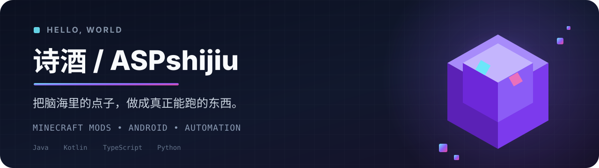

  

  

  
  
  
  

  
  
  

<table>
  <tr>
    <td width="52%" valign="top">
      <h2>⚡ PLAYER PROFILE</h2>
      <pre>
ALIAS        诗酒 / ASPshijiu
MAIN QUEST   Minecraft Mods
SIDE QUEST   Android + Automation
STATUS       Building the impossible
      </pre>
      
我喜欢把脑海里夸张、有趣的点子，做成真正能跑的东西。

      
当前主线：让经典模组在新版本 Minecraft 上重新运转，并把每个细节打磨到能真正游玩。

    </td>
    <td width="48%" valign="top">
      <h2>🧬 TECH LOADOUT</h2>
      

        
        
        
        
        
        
        
      

    </td>
  </tr>
</table>

<h2 align="center">🔥 ACTIVE QUEST</h2>

  

  把“无尽贪婪”带到新的 Minecraft 版本，并逐项重建物品、合成与完整玩法。

<h2 align="center">📡 LIVE SIGNAL</h2>

  

  

<picture>
  <source media="(prefers-color-scheme: dark)" srcset="https://raw.githubusercontent.com/ASPshijiu/ASPshijiu/output/github-contribution-grid-snake-dark.svg" />
  <source media="(prefers-color-scheme: light)" srcset="https://raw.githubusercontent.com/ASPshijiu/ASPshijiu/output/github-contribution-grid-snake.svg" />
  
</picture>

<h2 align="center">🕹️ WORKSHOP</h2>

<table>
  <tr>
    <td width="50%" valign="top">
      <h3>∞ <a href="https://github.com/ASPshijiu/avaritia-fabric-26.2">Avaritia Fabric 26.2</a></h3>
      
经典终局模组的 Fabric 适配，重建物品、合成与完整玩法。

      
    </td>
    <td width="50%" valign="top">
      <h3>◈ <a href="https://github.com/ASPshijiu/ProjectE-Fabric-26.2">ProjectE Fabric 26.2</a></h3>
      
将 EMC、炼金与经典 ProjectE 体验移植到现代 Fabric。

      
    </td>
  </tr>
  <tr>
    <td width="50%" valign="top">
      <h3>⌁ <a href="https://github.com/ASPshijiu/Steve">Steve</a></h3>
      
Cursor for Minecraft：探索更自然的游戏内创作与交互方式。

      
    </td>
    <td width="50%" valign="top">
      <h3>▦ <a href="https://github.com/ASPshijiu/BuildBot">BuildBot</a></h3>
      
围绕 Litematica 投影进行自动采集与建造的 Minecraft 工具。

      
    </td>
  </tr>
</table>

  
<b>⚙️ 展开更多实验项目</b>

   

- [MasaGadget](https://github.com/ASPshijiu/MasaGadget) — Masa 系工具与移植实验
- [Box-config](https://github.com/ASPshijiu/Box-config) — 网络配置与自动化模板
- [telebox-autoclean-plugin](https://github.com/ASPshijiu/telebox-autoclean-plugin) — Telegram 群组清理插件
- [pagermaid-plugins](https://github.com/ASPshijiu/pagermaid-plugins) — PagerMaid 插件集合

   
  
    
  MOD THE WORLD · AUTOMATE THE BORING · BUILD THE IMPOSSIBLE

